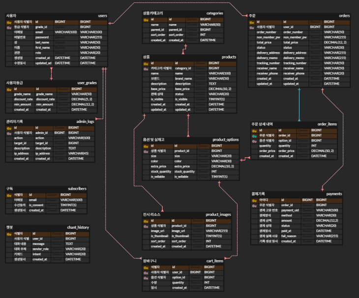

# ERD 클라우드 설계 초안

## 사용자 계층
```sql
CREATE TABLE `users` (
    `id`         BIGINT          NOT NULL AUTO_INCREMENT COMMENT 'PK, 자동 증가',
    `email`      VARCHAR(100)    NOT NULL UNIQUE         COMMENT '로그인 ID, 유니크',
    `password`   VARCHAR(255)    NULL                    COMMENT 'BCrypt 암호화 해시',
    `last_name`  VARCHAR(50)     NOT NULL                COMMENT '성',
    `first_name` VARCHAR(50)     NOT NULL                COMMENT '이름',
    `role`       VARCHAR(20)     NOT NULL DEFAULT 'USER' COMMENT 'ADMIN, USER 권한',
    `created_at` DATETIME        NOT NULL DEFAULT NOW()  COMMENT '생성 일시',
    `updated_at` DATETIME        NOT NULL DEFAULT NOW() ON UPDATE NOW() COMMENT '수정 일시',
    PRIMARY KEY (`id`)
)
```

```sql
CREATE TABLE `user_grades` (
    `id`             BIGINT          NOT NULL AUTO_INCREMENT COMMENT 'PK, 자동 증가',
    `grade_name`     VARCHAR(50)     NOT NULL UNIQUE         COMMENT '등급명 (SILVER, GOLD 등)',
    `discount_rate`  DECIMAL(5,2)    NOT NULL DEFAULT 0.00   COMMENT '할인율 (예: 5.50 = 5.5%)',
    `min_amount`     DECIMAL(12,2)   NOT NULL DEFAULT 0.00   COMMENT '등급 달성 최소 누적 금액',
    `created_at`     DATETIME        NOT NULL DEFAULT NOW()  COMMENT '생성 일시',
    PRIMARY KEY (`id`)
) ENGINE=InnoDB DEFAULT CHARSET=utf8mb4;
```

```sql
CREATE TABLE `admin_logs` (
    `id`             BIGINT          NOT NULL AUTO_INCREMENT COMMENT 'PK, 자동 증가',
    `admin_id`       BIGINT          NOT NULL                COMMENT '조작한 관리자 ID (users.id)',
    `action`         VARCHAR(100)    NOT NULL                COMMENT '수행 작업 (예: UPDATE_PRODUCT)',
    `target_id`      BIGINT          NULL                    COMMENT '작업 대상의 PK (상품ID 등)',
    `description`    TEXT            NULL                    COMMENT '상세 변경 내용 (JSON 등)',
    `ip_address`     VARCHAR(45)     NULL                    COMMENT '접속 IP 주소',
    `created_at`     DATETIME        NOT NULL DEFAULT NOW()  COMMENT '조작 일시',
    PRIMARY KEY (`id`)
) ENGINE=InnoDB DEFAULT CHARSET=utf8mb4;
```

## 상품 및 전시 계층
```sql
CREATE TABLE `categories` (
    `id`             BIGINT          NOT NULL AUTO_INCREMENT COMMENT 'PK, 자동 증가',
    `name`           VARCHAR(50)     NOT NULL                COMMENT '카테고리명',
    `parent_id`      BIGINT          NULL                    COMMENT '상위 카테고리 ID (Self-referencing)',
    `sort_order`     INT             NOT NULL DEFAULT 0      COMMENT '전시 순서',
    `created_at`     DATETIME        NOT NULL DEFAULT NOW()  COMMENT '생성 일시',
    PRIMARY KEY (`id`)
) ENGINE=InnoDB DEFAULT CHARSET=utf8mb4;
```

```sql
CREATE TABLE `product_options` (
    `id`             BIGINT          NOT NULL AUTO_INCREMENT COMMENT 'PK, 자동 증가',
    `product_id`     BIGINT          NOT NULL                COMMENT '상품 ID (products.id)',
    `size`           VARCHAR(20)     NOT NULL                COMMENT '사이즈 (S, M, L 등)',
    `color`          VARCHAR(30)     NOT NULL                COMMENT '색상',
    `extra_price`    DECIMAL(10,2)   NOT NULL DEFAULT 0.00   COMMENT '옵션 추가 금액 (기본가 + 가산)',
    `stock_quantity` INT             NOT NULL DEFAULT 0      COMMENT '현재 실재고 수량',
    `is_sellable`    TINYINT(1)      NOT NULL DEFAULT 1      COMMENT '판매 가능 여부 (품절 처리용)',
    PRIMARY KEY (`id`)
) ENGINE=InnoDB DEFAULT CHARSET=utf8mb4;
```

```sql
CREATE TABLE `products` (
    `id`             BIGINT          NOT NULL AUTO_INCREMENT COMMENT 'PK, 자동 증가',
    `category_id`    BIGINT          NOT NULL                COMMENT '소속 카테고리 ID (categories.id)',
    `name`           VARCHAR(100)    NOT NULL                COMMENT '상품명',
    `brand_name`     VARCHAR(50)     NOT NULL DEFAULT 'La Ligne Homme' COMMENT '브랜드명',
    `description`    TEXT            NULL                    COMMENT '상세 설명 (HTML 가능)',
    `base_price`     DECIMAL(10,2)   NOT NULL                COMMENT '기본 판매가',
    `status`         VARCHAR(20)     NOT NULL DEFAULT 'ON_SALE' COMMENT '판매 상태 (ON_SALE, OUT_OF_STOCK, STOPPED)',
    `is_visible`     TINYINT(1)      NOT NULL DEFAULT 1      COMMENT '노출 여부 (1:노출, 0:비노출)',
    `created_at`     DATETIME        NOT NULL DEFAULT NOW()  COMMENT '생성 일시',
    `updated_at`     DATETIME        NOT NULL DEFAULT NOW() ON UPDATE NOW() COMMENT '수정 일시',
    PRIMARY KEY (`id`)
) ENGINE=InnoDB DEFAULT CHARSET=utf8mb4;
```
- 브랜드 정체성과 판매 상태를 관리하는 컬럼 추가 (브랜드 확대및 교체 확장성 및 유지 보수성 확보)

```sql
CREATE TABLE `product_images` (
    `id`             BIGINT          NOT NULL AUTO_INCREMENT COMMENT 'PK, 자동 증가',
    `product_id`     BIGINT          NOT NULL                COMMENT '상품 ID (products.id)',
    `image_url`      VARCHAR(255)    NOT NULL                COMMENT 'Supabase 이미지 주소',
    `is_thumbnail`   TINYINT(1)      NOT NULL DEFAULT 0      COMMENT '대표 이미지 여부 (1:썸네일)',
    `sort_order`     INT             NOT NULL DEFAULT 0      COMMENT '이미지 노출 순서',
    `created_at`     DATETIME        NOT NULL DEFAULT NOW()  COMMENT '생성 일시',
    PRIMARY KEY (`id`)
) ENGINE=InnoDB DEFAULT CHARSET=utf8mb4;
```

## 거래 및 결제 계층

```sql
CREATE TABLE `orders` (
    `id`                 BIGINT          NOT NULL AUTO_INCREMENT COMMENT 'PK, 자동 증가',
    `user_id`            BIGINT          NULL                    COMMENT '주문자 ID (회원일 경우, 비회원은 NULL)',
    `order_number`       VARCHAR(50)     NOT NULL UNIQUE         COMMENT '비즈니스 주문 번호 (날짜+난수)',
    `non_member_pw`      VARCHAR(255)    NULL                    COMMENT '비회원 주문 조회용 암호 (BCrypt)',
    `total_price`        DECIMAL(12,2)   NOT NULL                COMMENT '총 결제 금액',
    `status`             VARCHAR(30)     NOT NULL DEFAULT 'PENDING' COMMENT '주문 상태 (PAYMENT_DONE, SHIPPING 등)',
    `delivery_address`   VARCHAR(255)    NOT NULL                COMMENT '배송지 주소',
    `delivery_memo`      VARCHAR(255)    NULL                    COMMENT '배송 요청사항 (예: 문 앞 배송)',
    `tracking_number`    VARCHAR(50)     NULL                    COMMENT '운송장 번호 (배송 시작 시 입력)',
    `receiver_name`      VARCHAR(50)     NOT NULL                COMMENT '수령인 이름',
    `receiver_phone`     VARCHAR(20)     NOT NULL                COMMENT '수령인 연락처',
    `created_at`         DATETIME        NOT NULL DEFAULT NOW()  COMMENT '주문 일시',
    `updated_at`         DATETIME        NOT NULL DEFAULT NOW() ON UPDATE NOW() COMMENT '수정 일시',
    PRIMARY KEY (`id`)
) ENGINE=InnoDB DEFAULT CHARSET=utf8mb4;
```
- 비회원 주문 기능위해 user_id null 가능, 비회원용 암호 컬럼(non_member_pw) 추가
- non_member_pw 역시 users테이블의 비밀번호처럼 BCrypt로 암호화해서 저장(관리자도 볼수 없게)
- 배송 정보 트래킹을 위한 컬럼들 추가(반정규화)

```sql
-- 주문 상세 내역 - ★스냅샷 중요
-- 어떤 옵션의 상품을 몇 개 샀는지 기록하며, 구매 당시의 가격을 보존해야 합니다
CREATE TABLE `order_items` (
    `id`             BIGINT          NOT NULL AUTO_INCREMENT COMMENT 'PK, 자동 증가',
    `order_id`       BIGINT          NOT NULL                COMMENT '부모 주문 ID (orders.id)',
    `option_id`      BIGINT          NOT NULL                COMMENT '구매 옵션 ID (product_options.id)',
    `quantity`       INT             NOT NULL                COMMENT '구매 수량',
    `order_price`    DECIMAL(10,2)   NOT NULL                COMMENT '구매 당시 단가 (스냅샷)',
    `created_at`     DATETIME        NOT NULL DEFAULT NOW()  COMMENT '생성 일시',
    PRIMARY KEY (`id`)
) ENGINE=InnoDB DEFAULT CHARSET=utf8mb4;
```

### 결제 
- 초기 개념 설계 쿼리
```sql
CREATE TABLE `payments` (
    `id`             BIGINT          NOT NULL AUTO_INCREMENT COMMENT 'PK, 자동 증가',
    `order_id`       BIGINT          NOT NULL UNIQUE         COMMENT '연결된 주문 ID (orders.id)',
    `method`         VARCHAR(30)     NOT NULL                COMMENT '결제 수단 (CARD, TRANSFER 등)',
    `transaction_id` VARCHAR(100)    NOT NULL                COMMENT 'PG사 승인 번호',
    `amount`         DECIMAL(12,2)   NOT NULL                COMMENT '실제 결제 금액',
    `paid_at`        DATETIME        NULL                    COMMENT '결제 승인 일시',
    `status`         VARCHAR(20)     NOT NULL DEFAULT 'READY' COMMENT '결제 상태 (READY, COMPLETED, CANCELLED)',
    `created_at`     DATETIME        NOT NULL DEFAULT NOW()  COMMENT '기록 생성 일시',
    PRIMARY KEY (`id`)
) ENGINE=InnoDB DEFAULT CHARSET=utf8mb4;
```

- 결제 통합 솔루션 연동형 DB 쿼리
```sql
CREATE TABLE `payments` (
    `id`               BIGINT          NOT NULL AUTO_INCREMENT COMMENT 'PK, 자동 증가',
    `order_id`         BIGINT          NOT NULL UNIQUE         COMMENT '연결된 주문 ID (orders.id)',
    `payment_uid`      VARCHAR(100)    NOT NULL UNIQUE         COMMENT 'PG사 결제 고유 번호 (예: imp_uid)',
    `method`           VARCHAR(30)     NOT NULL                COMMENT '결제 수단 (CARD, KAKAO_PAY 등)',
    `amount`           DECIMAL(12,2)   NOT NULL                COMMENT '실제 승인 금액 (검증용)',
    `status`           VARCHAR(20)     NOT NULL DEFAULT 'READY' COMMENT '상태 (READY, PAID, FAILED, CANCELLED)',
    `paid_at`          DATETIME        NULL                    COMMENT '결제 완료 일시',
    `fail_reason`      VARCHAR(255)    NULL                    COMMENT '결제 실패 시 사유',
    `created_at`       DATETIME        NOT NULL DEFAULT NOW()  COMMENT '기록 생성 일시',
    PRIMARY KEY (`id`)
) ENGINE=InnoDB DEFAULT CHARSET=utf8mb4;
```

## 마케팅 및 AI 확장 계층 

```sql
CREATE TABLE `subscribers` (
    `id`             BIGINT          NOT NULL AUTO_INCREMENT COMMENT 'PK, 자동 증가',
    `email`          VARCHAR(100)    NOT NULL UNIQUE         COMMENT '구독 이메일 (마케팅 타겟)',
    `is_consent`     TINYINT(1)      NOT NULL DEFAULT 1      COMMENT '광고 수신 동의 여부 (1:동의, 0:거부)',
    `created_at`     DATETIME        NOT NULL DEFAULT NOW()  COMMENT '구독 신청 일시',
    PRIMARY KEY (`id`)
) ENGINE=InnoDB DEFAULT CHARSET=utf8mb4;
```

```sql
CREATE TABLE `chat_history` (
    `id`             BIGINT          NOT NULL AUTO_INCREMENT COMMENT 'PK, 자동 증가',
    `user_id`        BIGINT          NULL                    COMMENT '회원 ID (비회원은 NULL)',
    `message`        TEXT            NOT NULL                COMMENT '대화 내용 (질문 또는 답변)',
    `sender_role`    VARCHAR(20)     NOT NULL                COMMENT '보낸 주체 (USER, AI_BOT, ADMIN)',
    `intent`         VARCHAR(50)     NULL                    COMMENT 'AI가 추출한 핵심 의도 (예: 배송, 반품, 추천)',
    `created_at`     DATETIME        NOT NULL DEFAULT NOW()  COMMENT '대화 기록 일시',
    PRIMARY KEY (`id`)
) ENGINE=InnoDB DEFAULT CHARSET=utf8mb4;
```
- intent 컬럼은 나중에 파이썬 서버에서 자연어 처리(NLP)를 통해 '배송'인지 '상품추천'인지 분류해서 넣어줄 자리. 이게 쌓여야 고객 맞춤형 서비스가 가능

## 관계 설정

### 📊 [La-Ligne-Homme] 관계 설정 명세 (Relationships)

| 관계명 | 부모 (1) | 자식 (N) | 식별/비식별 | 설명 |
| :--- | :--- | :--- | :--- | :--- |
| **회원-등급** | user_grades | users | 비식별 (점선) | 등급 정책에 따른 유저 분류 |
| **관리자-로그** | users | admin_logs | 비식별 (점선) | 관리자의 활동 추적 |
| **카테고리-상품** | categories | products | 비식별 (점선) | 상품 카테고리화 |
| **상품-옵션** | products | product_options | **식별 (실선)** | 상품 종속적 옵션 관리 (CASCADE) |
| **상품-이미지** | products | product_images | 비식별 (점선) | 상품 이미지 갤러리 |
| **유저-주문** | users | orders | 비식별 (점선) | 회원/비회원 주문 수용 |
| **주문-상세** | orders | order_items | **식별 (실선)** | 주문 종속적 품목 관리 (CASCADE) |
| **옵션-상세** | product_options | order_items | 비식별 (점선) | 구매 시점 옵션 정보 참조 |
| **주문-결제** | orders | payments | **1:1 비식별** | 주문당 1건의 결제 정보 |
| **유저-장바구니** | users | cart_items | 비식별 (점선) | 개인별 장바구니 관리 |
| **옵션-장바구니** | product_options | cart_items | 비식별 (점선) | 어떤 옵션을 담았는지 식별 |

### 관계 쿼리문
```sql
-- 1. 사용자 계층
ALTER TABLE `users` ADD CONSTRAINT `FK_user_grades_TO_users` FOREIGN KEY (`grade_id`) REFERENCES `user_grades` (`id`);
ALTER TABLE `admin_logs` ADD CONSTRAINT `FK_users_TO_admin_logs` FOREIGN KEY (`admin_id`) REFERENCES `users` (`id`);

-- 2. 상품 계층
ALTER TABLE `products` ADD CONSTRAINT `FK_categories_TO_products` FOREIGN KEY (`category_id`) REFERENCES `categories` (`id`);
ALTER TABLE `product_options` ADD CONSTRAINT `FK_products_TO_product_options` FOREIGN KEY (`product_id`) REFERENCES `products` (`id`) ON DELETE CASCADE;
ALTER TABLE `product_images` ADD CONSTRAINT `FK_products_TO_product_images` FOREIGN KEY (`product_id`) REFERENCES `products` (`id`) ON DELETE CASCADE;

-- 3. 거래 계층
ALTER TABLE `orders` ADD CONSTRAINT `FK_users_TO_orders` FOREIGN KEY (`user_id`) REFERENCES `users` (`id`);
ALTER TABLE `order_items` ADD CONSTRAINT `FK_orders_TO_order_items` FOREIGN KEY (`order_id`) REFERENCES `orders` (`id`) ON DELETE CASCADE;
ALTER TABLE `order_items` ADD CONSTRAINT `FK_product_options_TO_order_items` FOREIGN KEY (`option_id`) REFERENCES `product_options` (`id`);
ALTER TABLE `payments` ADD CONSTRAINT `FK_orders_TO_payments` FOREIGN KEY (`order_id`) REFERENCES `orders` (`id`);

-- 4. 운영 및 확장 계층
ALTER TABLE `cart_items` ADD CONSTRAINT `FK_users_TO_cart_items` FOREIGN KEY (`user_id`) REFERENCES `users` (`id`);
ALTER TABLE `cart_items` ADD CONSTRAINT `FK_product_options_TO_cart_items` FOREIGN KEY (`option_id`) REFERENCES `product_options` (`id`);
ALTER TABLE `chat_history` ADD CONSTRAINT `FK_users_TO_chat_history` FOREIGN KEY (`user_id`) REFERENCES `users` (`id`);
```

### 개념 ERD 초안 
