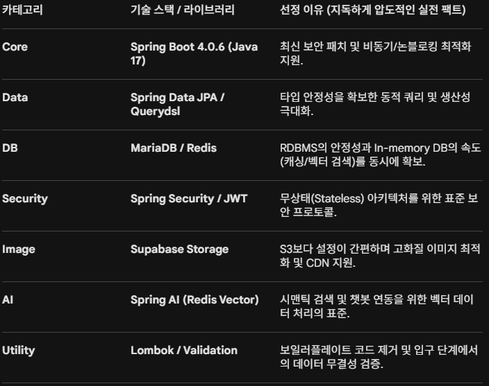

# 개념 모델링

## 프로젝트 생성
Gradle-Groovy, Java, 4.0.6 
Jar, Properties
ver: 17

## 의존성
```java
plugins {
	id 'java'
	id 'org.springframework.boot' version '4.0.6'
	id 'io.spring.dependency-management' version '1.1.7'
}

group = 'com.laligne'
version = '0.0.1-SNAPSHOT'

java {
	toolchain {
		languageVersion = JavaLanguageVersion.of(17)
	}
}

repositories {
	mavenCentral()
}

ext {
	set('springAiVersion', "2.0.0-M5")
}

dependencies {
	implementation 'org.springframework.boot:spring-boot-starter-data-jpa'
	implementation 'org.springframework.boot:spring-boot-starter-security'
	implementation 'org.springframework.boot:spring-boot-starter-validation'
	implementation 'org.springframework.boot:spring-boot-starter-webmvc'
	implementation 'org.springframework.ai:spring-ai-starter-vector-store-redis'
	compileOnly 'org.projectlombok:lombok'
	runtimeOnly 'org.mariadb.jdbc:mariadb-java-client'
	annotationProcessor 'org.projectlombok:lombok'
	testImplementation 'org.springframework.boot:spring-boot-starter-data-jpa-test'
	testImplementation 'org.springframework.boot:spring-boot-starter-security-test'
	testImplementation 'org.springframework.boot:spring-boot-starter-validation-test'
	testImplementation 'org.springframework.boot:spring-boot-starter-webmvc-test'
	testCompileOnly 'org.projectlombok:lombok'
	testRuntimeOnly 'org.junit.platform:junit-platform-launcher'
	testAnnotationProcessor 'org.projectlombok:lombok'
	annotationProcessor 'org.springframework.boot:spring-boot-configuration-processor'
	// Querydsl
	implementation 'com.querydsl:querydsl-jpa:5.0.0:jakarta'
	annotationProcessor "com.querydsl:querydsl-apt:5.0.0:jakarta"
	annotationProcessor "jakarta.annotation:jakarta.annotation-api"
	annotationProcessor "jakarta.persistence:jakarta.persistence-api"

	//OAuth2 Client
	implementation 'org.springframework.boot:spring-boot-starter-oauth2-client'
	//Redis (Standard)
	implementation 'org.springframework.boot:spring-boot-starter-data-redis'
	//WebClient (Reactive Web)
	implementation 'org.springframework.boot:spring-boot-starter-webflux'
}

dependencyManagement {
	imports {
		mavenBom "org.springframework.ai:spring-ai-bom:${springAiVersion}"
	}
}

tasks.named('test') {
	useJUnitPlatform()
}

def querydslDir = "src/main/generated"

sourceSets {
	main.java.srcDirs += [ querydslDir ]
}

tasks.withType(JavaCompile) {
	options.getGeneratedSourceOutputDirectory().set(file(querydslDir))
}

clean {
	delete file(querydslDir)
}
```


## 필수 테이블(추상화)
1. 사용자 계층 (Identity)
User: 회원 기본 정보 및 권한(Admin/User).

Admin_Log: 관리자의 시스템 조작 기록 (실전 운영의 핵심!!).

2. 상품 및 전시 계층 (Product & Display)
Product: 브랜드 상품의 핵심 메타데이터 (이름, 가격, 소재 등).

Product_Image: Supabase URL을 담는 이미지 저장소 정보.

Category: 상품 분류 체계 (상의, 하의, 액세서리 등).

3. 운영 및 재고 계층 (Operation)
Product_Stock: 실제 판매 가능한 사이즈/컬러별 수량.

Subscriber: 뉴스레터 및 마케팅 수신 동의 명단.

4. 거래 계층 (Transaction)
Orders: 주문 마스터 정보 (누가, 언제, 총 얼마를?).

Order_Item: 개별 주문 내역 (어떤 상품을 몇 개나?).

Payment: 결제 수단 및 승인 정보.

5. 지능형 서비스 계층 (AI Intelligence) : 현재 프론트에 구현은 안되어 있지만 확장성 고려
Product_Embedding: AI 검색을 위한 벡터 데이터 저장소.

Chat_History: 챗봇 상담 내역 (사용자 의도 분석용).

## 개념 모델링 핵심 요약

비회원 결제 비중: "비회원 주문이 메인인가요? 아니면 회원 가입을 지독하게 유도하는 방향인가요?" (이에 따라 User와 Orders의 무게중심이 달라집니다)

관리 업무의 핵심: "매일 상품 수천 개를 올리시나요? 아니면 하나를 올려도 지독하게 압도적인 고화질로 올리시나요 ㅋ" (Supabase 저장량 및 어드민 업로드 기능 설계의 척도)

등급 혜택의 종류: "등급별로 가격이 다른가요, 아니면 쿠폰이나 적립금이 다른가요" (Querydsl의 동적 가격 계산 로직 포함 여부 결정)

### (2026-05-11 12:26 최종 편집)

1. 핵심 엔티티 추출 (Entity Discovery)
실전 운영과 마케팅 확장성을 고려하여 추출된 5대 영역의 핵심 객체들입니다.

Identity (사용자): User(회원/OAuth2), User_Grade(가치 사다리), Admin_Log(운영 책임)

Product (전시): Product(메타데이터), Product_Image(Supabase URL), Category(분류)

Operation (재고): Product_Stock(사이즈/컬러별 실재고), Subscriber(뉴스레터 구독자)

Transaction (거래): Orders(회원/비회원 통합), Order_Item(주문 상세), Payment(결제)

AI (지능형): Product_Embedding(벡터 데이터), Chat_History(상담 로그)

2. 비즈니스 전술 및 관계 설계 (Business Logic)
비회원 구매 평등화: 비회원도 회원과 동일한 구매 범위를 가지며, 주문 번호와 비밀번호로 지독하게 압도적인 주문 조회가 가능하게 설계.

마케팅 접점 확보: 비회원 주문 시 '신상품 소식 구독' 여부를 필수로 체크하여 잠재 고객 리스트로 유도.

가치 사다리(CRM): 의뢰인의 요구에 따라 누적 금액, 구매 횟수 등 등급 산정 기준을 유연하게 조정 가능한 구조 확립.

인프라 분리: 고화질 패션 이미지는 Supabase Storage에 보관하고, DB에는 최적화된 URL만 저장하여 서버 부하 방지.

3. AI 및 관리자 확장성 (Future-Proof)
Admin-First: 프로젝트 중반에 피똥(?) 싸지 않도록 초기부터 RBAC(권한 제어) 및 관리자 전용 API 경로 선제 설계.

AI-Ready: Spring AI와 Redis Vector DB 연동을 고려하여 상품 설명의 임베딩화 및 시맨틱 검색을 위한 메타데이터 테이블 구성.

### 추가로 필요한 정보

1. 상품 옵션의 복잡도 (Product Variant)
질문: "상품 하나에 옵션(사이즈, 컬러)이 최대 몇 개까지 붙나요?  혹시 세트 상품(상의+하의 세트) 구성 계획도 있으신가요? "

이유: 옵션이 복잡하면 Product_Stock 설계가 더 고도화되어야 하고, 세트 상품이 있다면 Bundle 테이블을 추가로 고려해야 피똥(?) 안 쌉니다

2. 재고 차감 시점 (Stock Diminution)
질문: "재고는 결제 완료 시점에 깎을까요, 아니면 장바구니에 담거나 주문서를 작성하는 순간에 미리 잡아둘까요? "

이유: 실전에서는 결제 도중 품절되는 '동시성 이슈'가 지독하게 많이 터집니다!! 백엔드 로직 설계 방향(비관적/낙관적 락 사용 여부)이 여기서 결정됩니다

3. 이미지 외 리소스 확장성
질문: "혹시 룩북 영상(mp4)이나 고화질 GIF 애니메이션도 메인에 배치할 계획이 있으신가요? "

이유: Supabase Storage 용량 산정과 프론트엔드 최적화(Lazy Loading 등) 가이드가 달라집니다. 패션은 '영상'이 들어가면 서버 부하가 지독하게 압도적으로 늘어나니까요!! 

4. 환불 및 교환 프로세스 (CS 로직)
질문: "단순 변심에 의한 환불이나 사이즈 교환 프로세스도 자동화가 필요한가요?  아니면 관리자가 수동으로 처리하시나요? "

이유: Return과 Exchange 테이블 설계 여부를 결정합니다. 실전 커머스에서 가장 복잡한 게 바로 이 '반품 로직'입니다!! 

## 테스트 DB

### `La-Ligne-Homme` 잠정 봉인 기능 리스트 (복구 체크리스트)
1. Springdoc OpenAPI (Swagger)
상태: 라이브러리 및 설정 코드 전체 봉인

주석 처리된 위치:

build.gradle: implementation 'org.springdoc:springdoc-openapi-starter-webmvc-ui'

com.laligne.backend.config.OpenApiConfig: 클래스 전체 (@Configuration 포함)

application.properties: springdoc.* 관련 모든 설정값

복구 시점: 서버 기동이 완전히 안정화되고, API 명세서 시각화가 필요할 때 (현재 버전 충돌 이슈가 있으므로 2.8.5 이상 권장).

2. Spring AI (Redis Vector Store)
상태: 자동 설정 충돌로 인한 의존성 격리

주석 처리된 위치:

build.gradle: implementation 'org.springframework.ai:spring-ai-starter-vector-store-redis'

application.properties: spring.ai.vectorstore.redis.enabled=false (현재는 라이브러리 자체를 주석했으므로 의미 없으나 기록 유지)

복구 시점: OpenAI API 연동 및 Embedding 모델 설정을 완료하여 '두뇌'를 장착할 준비가 되었을 때.

3. Querydsl 관련 자동 스캔
상태: QClass 부재로 인한 간섭 차단 (설정 위주)

조치 내용:

application.properties: springdoc.querydsl.enabled=false

복구 시점: 실제 JPA Repository에 Querydsl을 적용하고, compileJava를 통해 src/main/generated에 QClass들이 정상적으로 생성된 이후.

## 답변 추가 내용

1. 장바구니 옵션 추가 (Product Variant & Cart)
설계 방향: Product 테이블과 별개로 Product_Option(사이즈, 컬러) 테이블을 반드시 분리해야 합니다.

장바구니 로직: 장바구니(Cart_Item) 저장 시 Product_ID가 아니라 Option_ID를 참조하게 설계하십시오. 그래야 "상의 L사이즈 블랙" 같은 구체적인 상품을 담을 수 있습니다.

2. CS 수동 처리 (Admin-Oriented)
설계 방향: 환불/교환을 위한 복잡한 자동화 로직(API 연동 등)은 생략하되, 주문 상태(Status) 값은 아주 세밀하게 쪼개야 합니다.

상태 값 예시: PAYMENT_COMPLETE → PREPARING → SHIPPING → DELIVERED → CANCEL_REQUESTED → CANCEL_COMPLETED.

어드민 필수: 관리자가 직접 이 상태 값을 '딸깍' 변경할 수 있는 [관리자 전용 API]가 이 프로젝트의 핵심이 됩니다.

3. 세트 상품 계획 없음 (Normalization)
설계 방향: 다행히 Bundle이나 Package 같은 복잡한 다대다(N:M) 관계는 고려하지 않아도 됩니다.

구조: 단품 위주의 깔끔한 1:N(Product : Option) 구조로 지독하게 압도적인 속도를 뽑아낼 수 있습니다.

## 프로젝트 구조

```
com.laligne.backend
├── global              # 공통 설정 및 유틸리티
│   ├── config          # Security, Querydsl, Redis 설정
│   ├── common          # 공통 응답(BaseResponse), 에러 코드
│   ├── error           # Custom Exception 및 Global Handler
│   └── util            # JwtTokenProvider, S3/Supabase Util
│
├── domain              # 비즈니스 도메인 (핵심 로직)
│   ├── auth            # OAuth2, Login, 권한 제어
│   ├── user            # 회원 정보, 등급(Grade)
│   ├── product         # 상품 메타데이터, 카테고리, 이미지
│   ├── option          # 상품 옵션(사이즈/컬러), 실재고(Stock)
│   ├── cart            # 장바구니 (Option_ID 참조 핵심!)
│   ├── order           # 주문서, 주문 상세(Order_Item)
│   ├── payment         # 결제 내역
│   └── admin           # 관리자 전용 CS 처리, 로그 기록
│
└── infrastructure      # 외부 연동 (AI, 메일 발송 등)
    ├── ai              # Spring AI (현재는 주석 처리 구역)
    └── redis           # Redis Vector Store 및 캐싱 로직
```

## ERD 개요
### 실전 엔티티 관계도 (ERD Concept)
1. Identity & Grade (사용자 계층)
User: id(PK), email, password, name, role(ADMIN/USER), grade_id(FK).

User_Grade: id(PK), grade_name, discount_rate, min_amount. (등급별 혜택 관리)

Admin_Log: id(PK), admin_id(FK), action, target_id, created_at. (누가 뭘 바꿨나!!)

2. Product & Option (상품 계층 - 핵심!)
Category: id(PK), name, parent_id. (계층형 카테고리)

Product: id(PK), category_id(FK), name, description, base_price, is_visible.

Product_Option: id(PK), product_id(FK), size, color, additional_price, stock_quantity.

전략: 고객의 '장바구니 옵션' 요청에 따라 모든 재고와 가격 변동은 여기서 관리합니다.

Product_Image: id(PK), product_id(FK), image_url, is_thumbnail, sort_order.

3. Order & Transaction (거래 계층)
Orders: id(PK), user_id(FK), order_number(Unique), total_price, status, delivery_address.

상태값(Status): 마스터가 제안한 세밀한 단계(PAYMENT_DONE, SHIPPING, 등) 적용.

Order_Item: id(PK), order_id(FK), option_id(FK), quantity, order_price.

주의: Product_ID가 아닌 Option_ID를 직접 참조하여 구체적 옵션을 특정합니다.

Payment: id(PK), order_id(FK), method, transaction_id, amount, paid_at.

4. Marketing & AI (확장 계층)
Subscriber: id(PK), email, is_consent, created_at. (뉴스레터 명단)

Chat_History: id(PK), user_id(FK), message, intent, created_at. (AI 분석용)